# Fase 5 — Diagramas del Sistema

**Proyecto:** Iuris / SGPJ — Sistema de Gestión de Procesos Jurídicos
**Deriva de:** [`04-historias-de-usuario.md`](04-historias-de-usuario.md) · [`03-requisitos-funcionales-y-no-funcionales.md`](03-requisitos-funcionales-y-no-funcionales.md) · [`02-reglas-de-negocio.md`](02-reglas-de-negocio.md) · [`01-idea-y-definicion-de-negocio.md`](01-idea-y-definicion-de-negocio.md)
**Versión:** 1.1 · **Fecha:** 2026-08-20 · **Estado: CERRADA** — A-04 resuelto por D-17

---

## 0. Cómo leer este documento

Ningún diagrama se dibujó desde cero. Cada uno tiene una **fuente documental** en las fases anteriores:

> **Pendiente declarado (D-24).** Estos diagramas se dibujaron sobre las 42 historias de la Fase 4. Durante la construcción se añadieron **HU-43** y **HU-44** (cambio y restablecimiento de contraseña), que **todavía no están reflejadas** en el diagrama de casos de uso. Se anota aquí en lugar de dejar que el lector lo descubra comparando: un diagrama incompleto que no se sabe incompleto es peor que uno que lo declara.

| Diagrama | Sale de |
|---|---|
| 1 · Casos de uso | Actores (Fase 1 §6) + las 42 historias |
| 2 · Funcional | Los 12 módulos M1–M12 (Fase 3 §2) |
| 3 · Modelo de datos | Glosario (Fase 1 §8) + reglas G1–G4 |
| 4 · Clases | Modelo de datos + reglas de comportamiento G5–G7 |
| 5 · Componentes | Módulos + decisiones de desacoplamiento **[D-04]** |
| 6 · Despliegue | Stack **[D-02]** + RNF de seguridad |
| 7 · Secuencia | Historias críticas HU-25, HU-32, HU-39 |
| 8 · Actividad | Reglas del ciclo de términos G6 |
| 9 · Flujo del sistema | Visión global |
| 10 · Flujos individuales | Procesos de negocio PN-1 a PN-5 (Fase 1 §7) |

**Los diagramas están en formato Mermaid.** Para verlos renderizados: la versión publicada como Artifact, VS Code con extensión Mermaid, o mermaid.live.

---

## 1. Diagrama de Casos de Uso

Los actores son los de la Fase 1 §6. Recuérdese que **el Sistema es un actor temporal**: ejecuta casos de uso que nadie invoca — y son justamente los que justifican el proyecto.

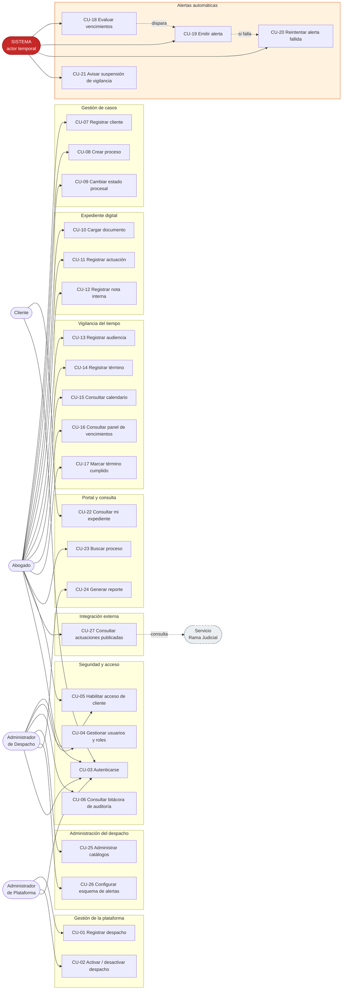

### Lectura del diagrama

**El paquete P6 no tiene ningún actor humano apuntando hacia él.** Es la observación central: los cuatro casos de uso que cumplen la promesa del sistema los ejecuta el propio sistema.

| Caso de uso | Historia | Requisito |
|---|---|---|
| CU-18 Evaluar vencimientos | HU-25 | RF-24 |
| CU-19 Emitir alerta | HU-25, HU-26, HU-27 | RF-24, RF-25, RF-26 |
| CU-20 Reintentar alerta fallida | HU-29 | RNF-08 |
| CU-21 Avisar suspensión de vigilancia | HU-31 | RF-37 |

**El actor Rama Judicial se dibuja con línea discontinua** porque es externo y no controlado: RN-49 exige que su caída no afecte a ningún otro paquete.

---

## 2. Diagrama Funcional (descomposición)

```mermaid
flowchart TD
    S["IURIS / SGPJ<br/>Sistema de Gestión de Procesos Jurídicos"]

    S --> F1["F1 · Administración<br/>de la plataforma"]
    S --> F2["F2 · Gestión<br/>del despacho"]
    S --> F3["F3 · Gestión<br/>de casos"]
    S --> F4["F4 · Vigilancia<br/>del tiempo ★"]
    S --> F5["F5 · Información<br/>y consulta"]

    F1 --> F11["Registro de despachos<br/>M1 · RF-01"]
    F1 --> F12["Estado activo/inactivo<br/>M1 · RF-02, RF-03"]

    F2 --> F21["Usuarios y roles<br/>M2 · RF-05, RF-06"]
    F2 --> F22["Autenticación<br/>M2 · RF-04"]
    F2 --> F23["Auditoría<br/>M2 · RF-08"]
    F2 --> F24["Catálogos<br/>M11 · RF-33"]
    F2 --> F25["Esquema de alertas<br/>M11 · RF-34"]

    F3 --> F31["Clientes<br/>M3 · RF-09, RF-10"]
    F3 --> F32["Procesos<br/>M4 · RF-11, RF-12, RF-14"]
    F3 --> F33["Expediente digital<br/>M4-M5 · RF-13, RF-15, RF-17, RF-18, RF-38"]

    F4 --> F41["Audiencias<br/>M6 · RF-19, RF-20"]
    F4 --> F42["Términos<br/>M7 · RF-21, RF-22, RF-23"]
    F4 --> F43["Motor de alertas<br/>M8 · RF-24 a RF-27, RF-37"]

    F5 --> F51["Búsqueda<br/>M10 · RF-31"]
    F5 --> F52["Reportes<br/>M10 · RF-32"]
    F5 --> F53["Portal del cliente<br/>M9 · RF-28, RF-29, RF-30"]
    F5 --> F54["Consulta Rama Judicial<br/>M12 · RF-35, RF-36"]

    style F4 fill:#fff3e0,stroke:#e65100,stroke-width:3px
    style F43 fill:#ffe0b2,stroke:#e65100,stroke-width:2px
    style F54 stroke-dasharray: 5 5
```

**F4 es la función que justifica el proyecto.** F1, F2, F3 y F5 existen en cualquier gestor documental; F4 es lo que responde a la razón por la que el consultorio pide el sistema.

---

## 3. Modelo de Datos

### 3.1 Principio estructural

Toda entidad cuelga del **Despacho** (RN-01). No es una decoración del diagrama: es la condición que hace posible el aislamiento RN-02.

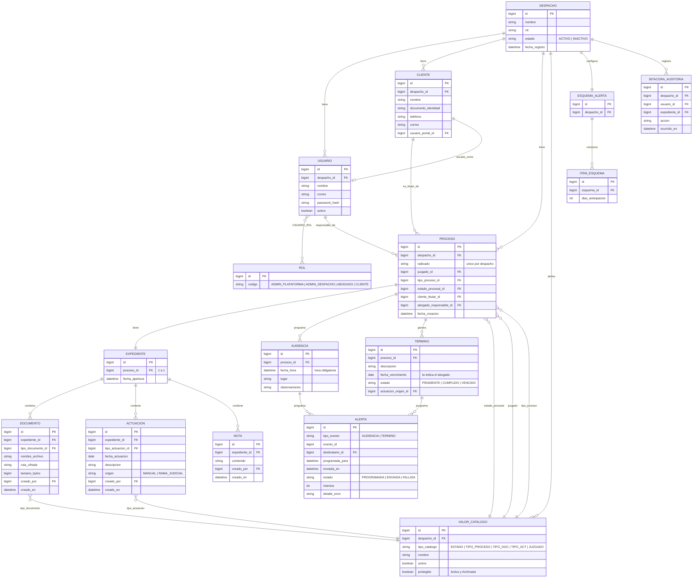

### 3.2 Las siete decisiones de modelado que hay que justificar

| # | Decisión | Por qué, y qué regla la obliga |
|---|---|---|
| 1 | **`despacho_id` en toda entidad raíz** | Sin la columna no hay forma de filtrar por tenant. **RN-01, RN-02** |
| 2 | **`USUARIO_ROL` como tabla intermedia** (muchos a muchos) | Un `rol_id` dentro de `USUARIO` haría **imposible** el abogado independiente, que necesita dos roles simultáneos. **RN-08** |
| 3 | **`VALOR_CATALOGO` única, con `tipo_catalogo`** | Cinco tablas casi idénticas serían duplicación. Una sola tabla tipificada, con `despacho_id`, cubre los cinco catálogos administrables — incluido **Juzgado**, que se añadió sin crear ninguna tabla nueva. **RN-06a, RN-06b, D-13, D-17** |
| 4 | **`protegido` en `VALOR_CATALOGO`** | Es el mecanismo que impide desactivar *Activo* y *Archivado*, exigidos por P-RF05. **RN-06a** |
| 5 | **`ALERTA` como entidad persistida, no calculada al vuelo** | Sin fila no hay forma de saber si se envió, ni de reintentar, ni de demostrarlo después. **RN-33, RN-34** |
| 6 | **`CLIENTE.usuario_portal_id` opcional** | El cliente existe en el sistema **antes** de tener acceso al portal; el acceso lo habilita el despacho después. **RN-43, D-15** |
| 7 | **`ACTUACION.origen`** | Distingue lo registrado por el abogado de lo traído de la Rama Judicial, que **nunca** puede presentarse como oficial. **RN-48** |

### 3.3 Lo que NO está en el modelo, deliberadamente

| Ausencia | Motivo |
|---|---|
| Tablas de plan, precio, factura, pago | La monetización ocurre fuera del sistema. **D-06** |
| Campo `visible` en `DOCUMENTO` y `ACTUACION` | El cliente ve **todas**; la visibilidad depende del *tipo de pieza*, no de una marca por pieza. **D-12** |
| Campo `eliminado` o borrado físico | Ni procesos ni piezas del expediente se eliminan. **RN-19, RN-27** |
| Campo de honorarios | Fuera de alcance. **D-08** |

### 3.4 Resolución del asunto A-04 — *Juzgado* como quinto catálogo **[D-17]**

**El problema detectado:** `PROCESO.juzgado` estaba modelado como texto libre. Con P-RNF02 **[P]** exigiendo búsqueda por juzgado, el mismo juzgado acabaría escrito de formas distintas —*"Juzgado 1 Civil"*, *"J. 1° Civil del Circuito"*, *"juzgado primero civil"*— y la búsqueda devolvería resultados incompletos. **Un requisito literal de la propuesta habría quedado degradado.**

**La resolución:** `juzgado_id` con clave foránea a `VALOR_CATALOGO`, `tipo_catalogo = 'JUZGADO'`. **Cero tablas nuevas, cero migración** — no hay datos aún — y RF-33 ya tenía la pantalla construida.

**La decisión no obvia fue el ámbito, no la existencia del catálogo.** Los juzgados son entidades del mundo real, compartidas entre despachos: parecería que corresponden a una lista nacional mantenida por el Administrador de Plataforma. Se descartó, y el motivo importa:

> Un directorio nacional de juzgados es una **responsabilidad de mantenimiento permanente** que ningún requisito pidió, que se desactualiza sola, y que convertiría al Administrador de Plataforma en curador de datos jurídicos — un rol que la Fase 1 le negó explícitamente.

Un despacho litiga ante un puñado de juzgados, no ante todos los del país. Su lista se construye sola con el uso. Y si más adelante la duplicación entre despachos llega a doler, **promover el catálogo a global es sencillo; el camino inverso no lo es.**

## 4. Diagrama de Clases

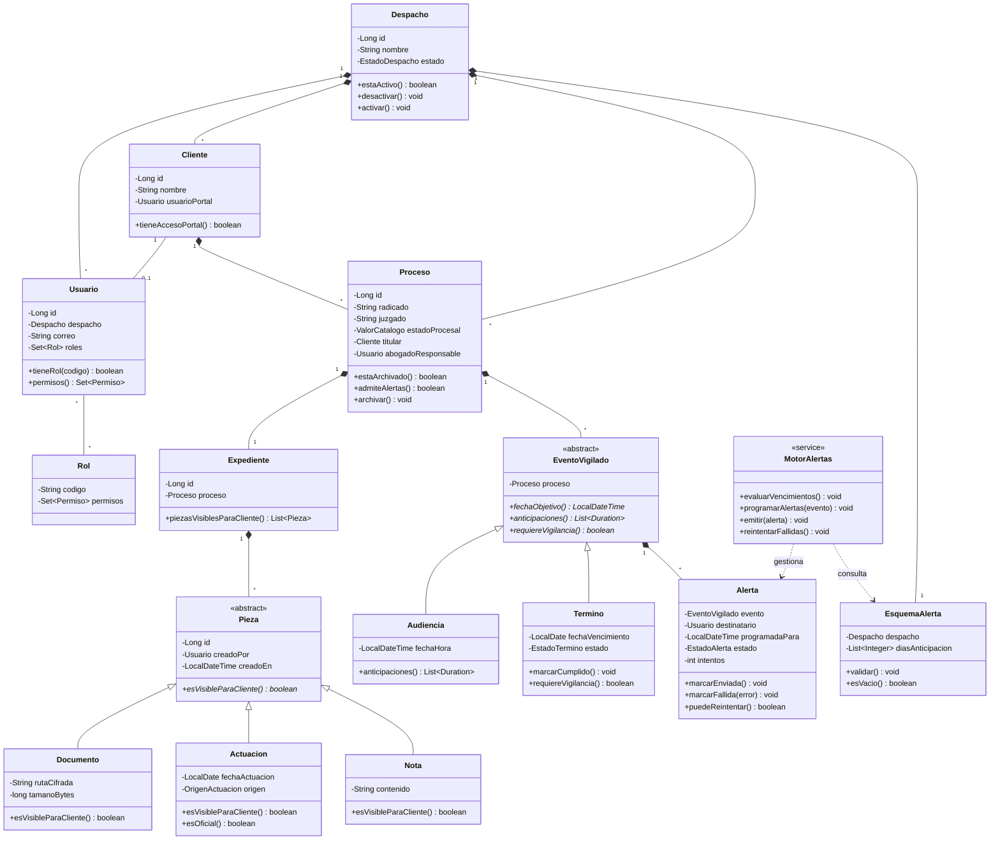

### Las tres abstracciones del diseño

**1 · `Pieza` abstracta con `esVisibleParaCliente()`**
Las tres piezas del expediente comparten estructura (autor, fecha) pero difieren en **una sola cosa**: si el cliente las ve. `Documento` y `Actuacion` devuelven `true`; `Nota` devuelve `false`, siempre. Poner la visibilidad como método polimórfico —y no como un `if` repartido por el portal— hace que **RN-24 sea imposible de violar por olvido**: el día que se añada una cuarta pieza, el compilador obligará a decidir su visibilidad.

**2 · `EventoVigilado` abstracta**
Audiencias y términos son cosas distintas del dominio, pero para el motor de alertas son **lo mismo**: algo con una fecha objetivo y un esquema de anticipaciones. Esta abstracción evita duplicar toda la lógica de vigilancia. `Audiencia.anticipaciones()` devuelve las tres fijas de P-RF03; `Termino.anticipaciones()` consulta el esquema configurable de D-16.

**3 · `EsquemaAlerta.validar()`**
La barrera contra R-08 vive **en el modelo de dominio**, no en el formulario. Si estuviera solo en la interfaz, una carga masiva o un cambio por API podría dejar un despacho con cero alertas.

---

## 5. Diagrama de Componentes

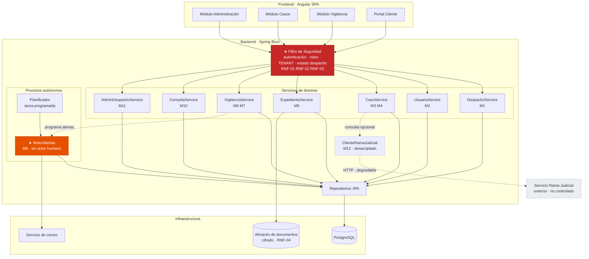

### Las tres decisiones de componentes

**1 · El Filtro de Seguridad es un punto único de paso.**
Toda petición del frontend lo atraviesa antes de llegar a cualquier servicio. Allí se resuelven cuatro cosas juntas: autenticación (RF-04), roles por unión (RNF-03), **tenant del usuario** (RNF-01) y **estado del despacho** (RNF-02).

Está dibujado así porque RNF-02 lo exige literalmente: *"en un único punto de control"*. Si el estado del despacho se verificara servicio por servicio, alguno se olvidaría — y ese olvido sería una funcionalidad operando en un despacho inactivo.

**2 · El Motor de Alertas cuelga del Planificador, no del frontend.**
No hay ninguna flecha desde la interfaz hacia `MotorAlertas`. Es la representación gráfica de RN-30: **ningún usuario invoca las alertas**. Si existiera esa flecha, el sistema habría vuelto a depender de que alguien se acuerde.

**3 · `ClienteRamaJudicial` está aislado con línea discontinua.**
Ningún servicio del núcleo depende de él: solo `CasoService` lo consulta, y de forma opcional. Es RN-49 hecho estructura — la caída del servicio externo no puede propagarse.

---

## 6. Diagrama de Despliegue

Stack: **Angular + Spring Boot + PostgreSQL** **[D-02]**.

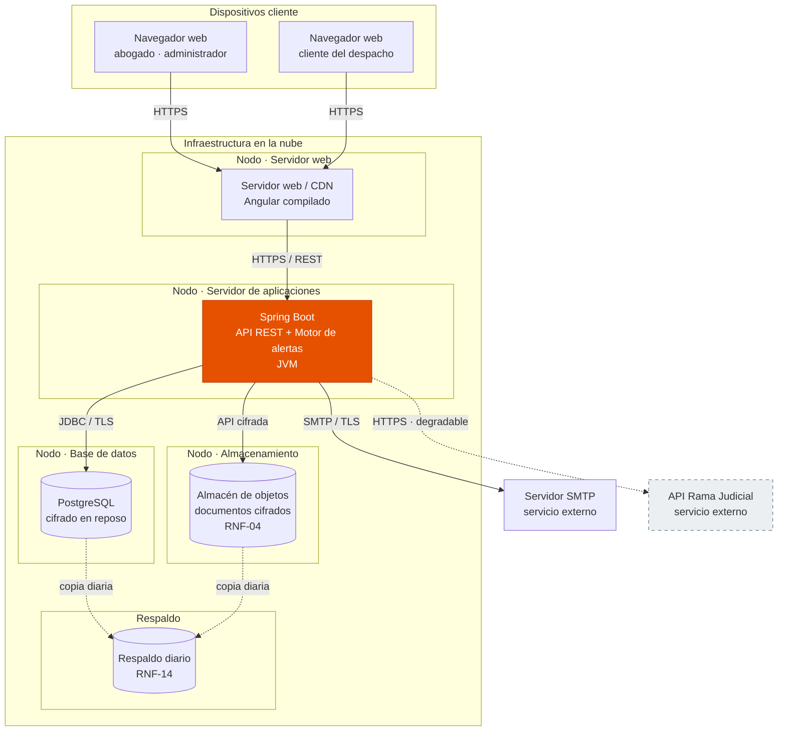

### Notas de despliegue

| Punto | Justificación |
|---|---|
| **Todo el tráfico va por HTTPS/TLS**, incluido el portal del cliente | RNF-06, sin excepciones |
| **Documentos separados de la base de datos**, en almacén de objetos cifrado | RNF-04. Separarlos permite cifrar y respaldar con políticas propias |
| **El Motor de Alertas vive dentro del nodo de aplicación** | Simplifica el despliegue del proyecto. ⚠ Si se escalara a varias instancias, habría que garantizar que la alerta se emite **una sola vez** (RNF-10) mediante bloqueo distribuido. Queda anotado para la Fase 6 |
| **Respaldo diario de BD y del almacén** | RNF-14. Los documentos también se respaldan: respaldar solo la base dejaría expedientes sin sus piezas |
| **La API de la Rama Judicial va con línea discontinua** | Su caída no debe afectar al nodo de aplicación (RN-49) |

---

## 7. Diagramas de Secuencia

### 7.1 Emisión de una alerta ★ — el flujo que justifica el sistema

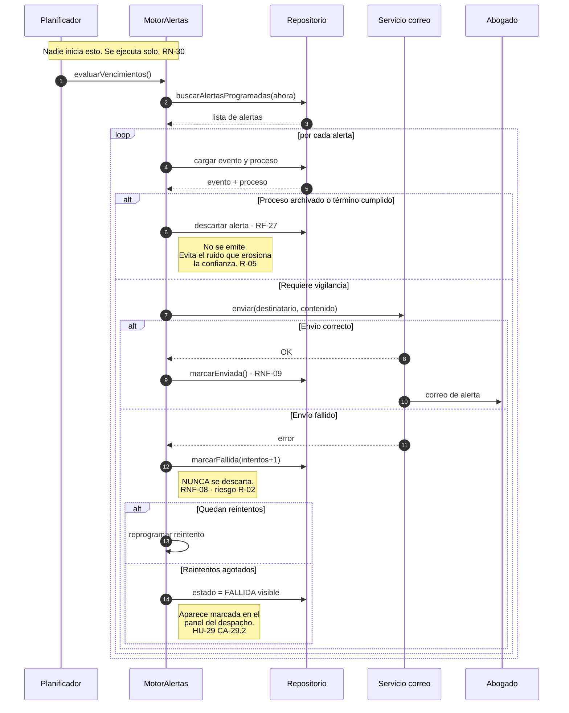

**El punto crítico es la rama de envío fallido.** Ahí está la diferencia entre un sistema en el que se puede confiar y uno que es peor que no tener nada: la alerta fallida **nunca desaparece**, se reintenta y, si se agota, queda visible dentro del sistema.

### 7.2 Acceso del cliente a su expediente

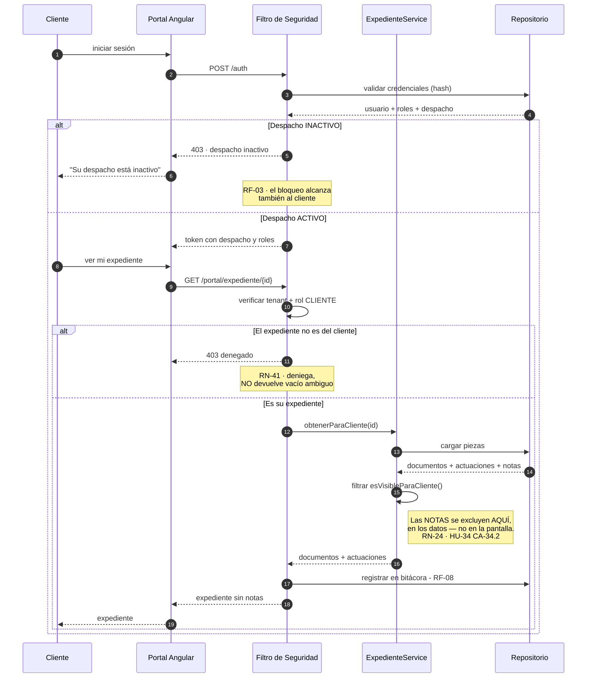

**El filtrado de notas ocurre en el servicio, no en el portal.** Si el servicio devolviera las notas y Angular simplemente no las pintara, la información ya habría salido del despacho — bastaría abrir las herramientas del navegador. Es CA-34.2 hecho secuencia.

### 7.3 Consulta a la Rama Judicial, con degradación

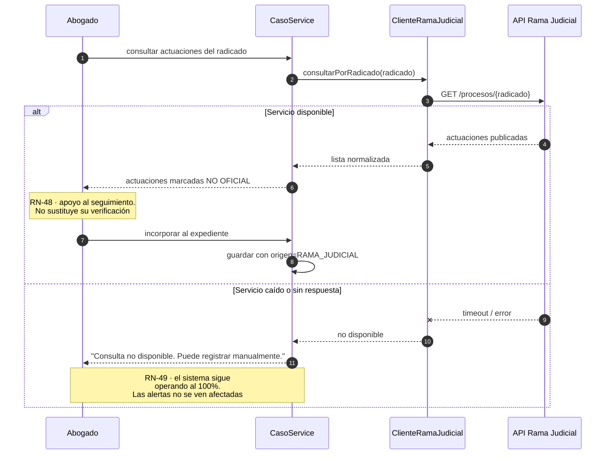

---

## 8. Diagrama de Actividad — ciclo de vida de un término

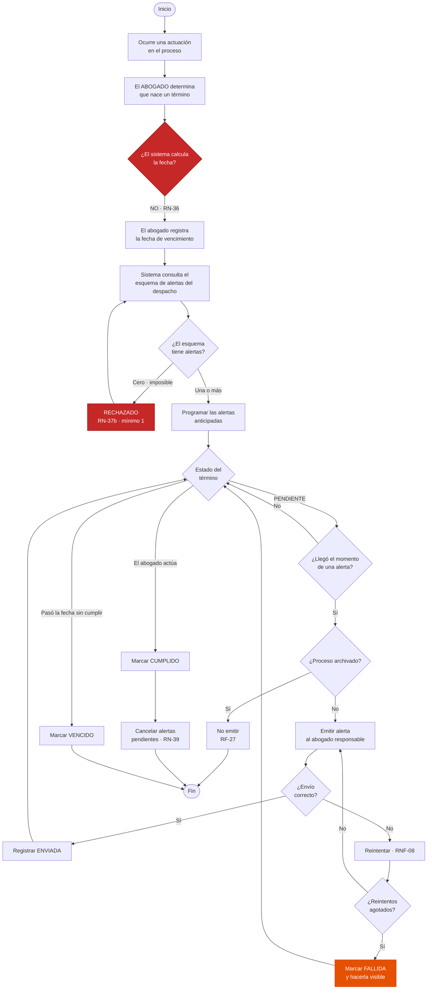

**Los dos nodos rojos son las fronteras del sistema:** A3 marca dónde el sistema **no** cruza (no calcula plazos, RN-36) y A7 marca dónde el sistema **no cede** (no acepta cero alertas, RN-37b). Uno protege la responsabilidad profesional; el otro, la razón de ser del producto.

---

## 9. Flujo General del Sistema

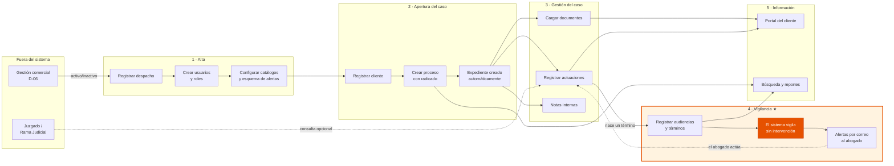

**El ciclo se cierra en la flecha punteada de retorno:** la alerta lleva al abogado a actuar, esa actuación se registra, y de ella puede nacer un nuevo término. **El sistema no es lineal, es un ciclo de vigilancia continua** — y esa es la diferencia con un archivador digital.

---

## 10. Flujos Individuales — procesos de negocio

Corresponden a PN-1 a PN-5 de la Fase 1 §7.

### 10.1 PN-1 · Vinculación del cliente y apertura del proceso *(Sprint 1)*

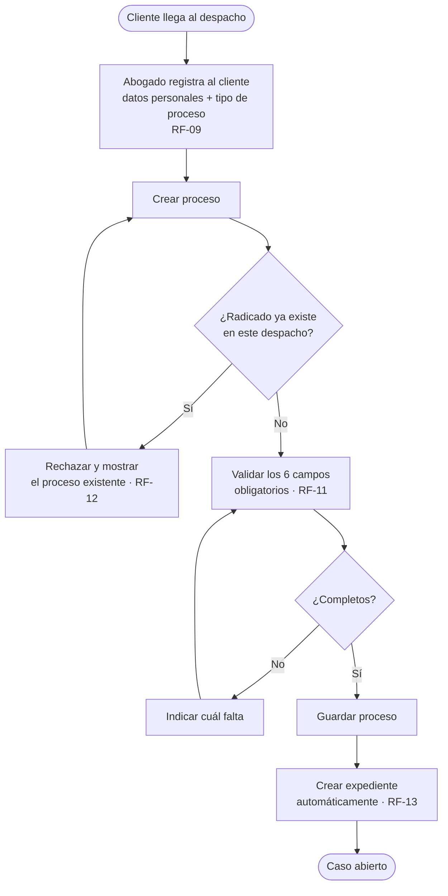

### 10.2 PN-2 · Gestión del expediente *(Sprint 2)*

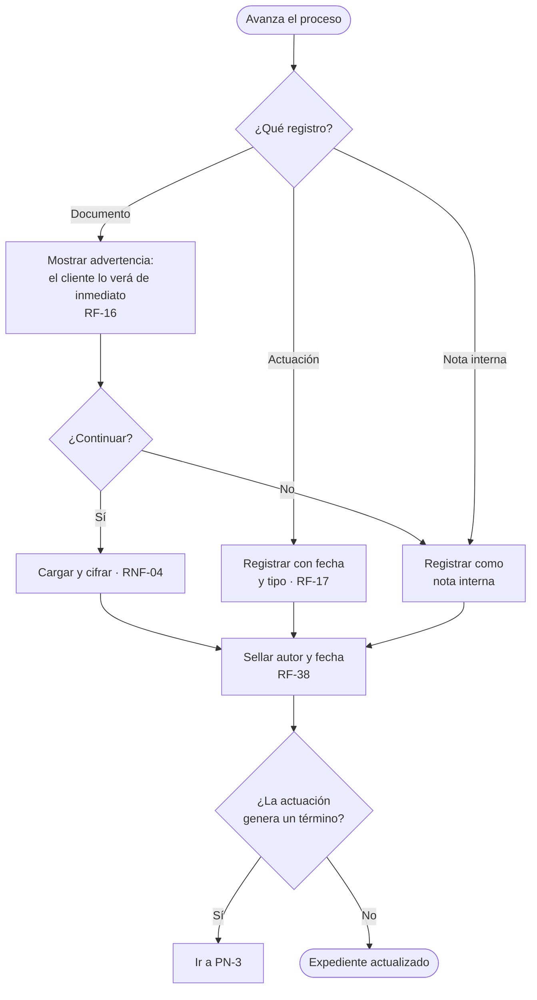

### 10.3 PN-3 · Vigilancia de audiencias y términos ★ *(Sprint 3)*

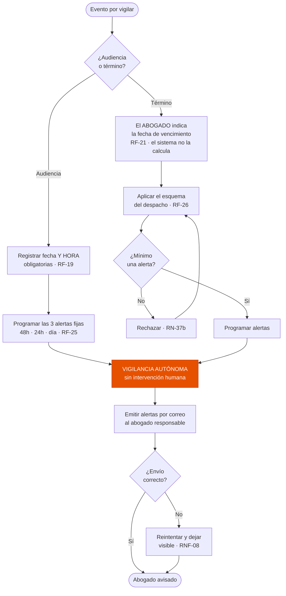

### 10.4 PN-4 · Información al cliente y control del despacho *(Sprint 4)*

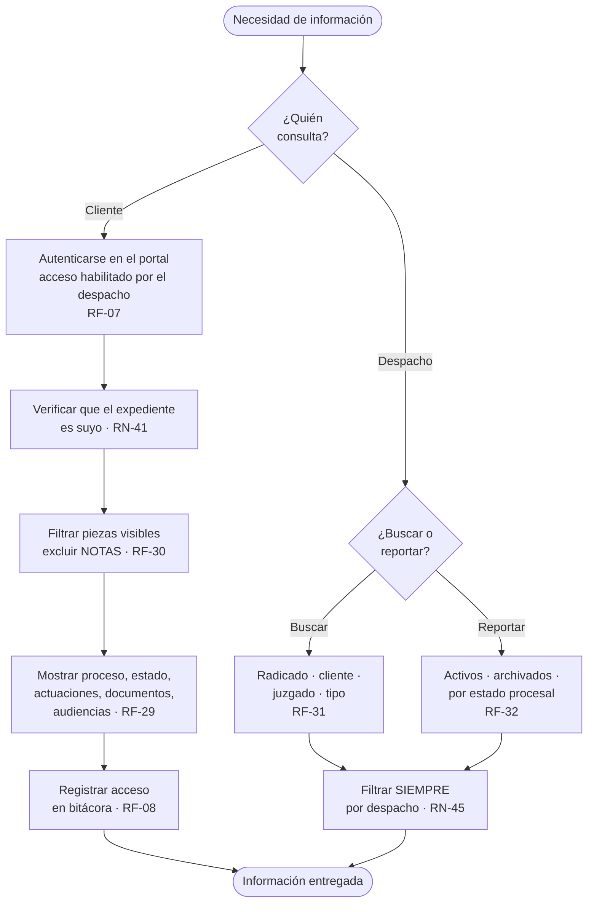

### 10.5 PN-5 · Sincronización con la Rama Judicial *(posterior)*

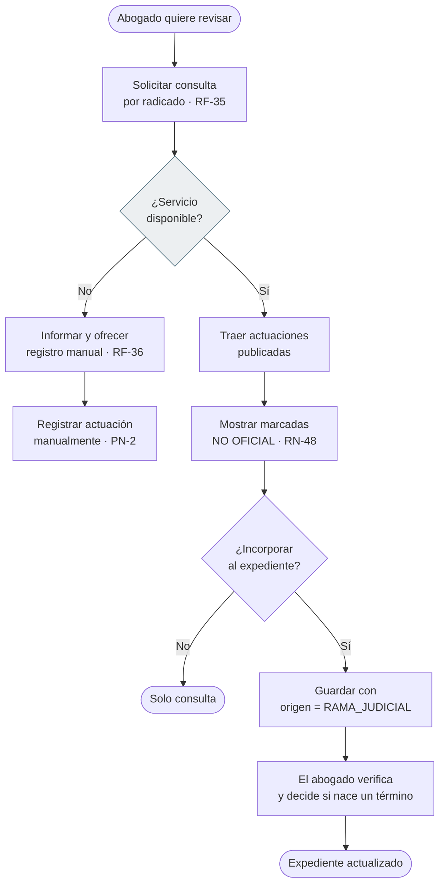

**Obsérvese que ambas ramas de C llevan a un expediente actualizado.** Eso es RN-49 hecho diagrama: el servicio externo caído no bloquea nada, solo cambia el camino.

---

## 11. Verificación de coherencia

Comprobación de que los diagramas no contradicen la documentación previa:

| Regla crítica | Dónde se ve materializada |
|---|---|
| **RN-02** aislamiento | `despacho_id` en el modelo de datos · Filtro de Seguridad en componentes · verificación de tenant en secuencia 7.2 |
| **RN-08** roles acumulables | `USUARIO_ROL` muchos a muchos · `Usuario.permisos()` por unión en clases |
| **RN-24** notas nunca al cliente | `Nota.esVisibleParaCliente() = false` en clases · filtrado en el **servicio** en secuencia 7.2 · PN-4 |
| **RN-30** alertas sin actor humano | Paquete P6 sin actores en casos de uso · sin flecha desde el frontend en componentes · secuencia 7.1 iniciada por el Planificador |
| **RN-34** ninguna alerta en silencio | Entidad `ALERTA` persistida · rama de fallo en 7.1 · nodo A18 en actividad |
| **RN-36** no calcular plazos | Nodo rojo A3 en el diagrama de actividad · PN-3 |
| **RN-37b** mínimo una alerta | `EsquemaAlerta.validar()` en clases · nodo rojo A7 en actividad · PN-3 |
| **RN-49** degradación externa | Línea discontinua en componentes y despliegue · ambas ramas de 7.3 y PN-5 terminan bien |

---

## 12. Cierre de la fase

### Asunto detectado en esta fase — resuelto

| ID | Asunto | Desenlace |
|---|---|---|
| **A-04** | `PROCESO.juzgado` es texto libre, pero P-RNF02 exige buscar por juzgado | **Resuelto → D-17.** Quinto catálogo administrable por despacho. Ver §3.4 |

### Anotación para la Fase 6 — resuelta

El Motor de Alertas se desplegó dentro del nodo de aplicación. Si se escalara a varias instancias, **dos instancias podrían emitir la misma alerta**, violando RNF-10. **Resuelto en ADR-04:** las alertas se toman con `SELECT … FOR UPDATE SKIP LOCKED`, que además reparte el trabajo entre instancias en lugar de dejar una sola trabajando.

### Qué habilita la Fase 6

La arquitectura bajo **ISO/IEC/IEEE 42010** organiza el sistema en **vistas** dirigidas a las preocupaciones de cada interesado. Estos diagramas son la materia prima:

| Vista 42010 | Diagramas que la alimentan |
|---|---|
| Lógica | Clases (§4) · Modelo de datos (§3) |
| Procesos | Secuencia (§7) · Actividad (§8) |
| Desarrollo | Componentes (§5) · Funcional (§2) |
| Física | Despliegue (§6) |
| Escenarios | Casos de uso (§1) · Flujos (§9, §10) |

Y las **preocupaciones de los interesados** ya están identificadas: confidencialidad (RN-02, RN-24), confiabilidad de la alerta (R-02, R-08), frontera de responsabilidad legal (RN-36) y degradación ante servicios externos (RN-49).
