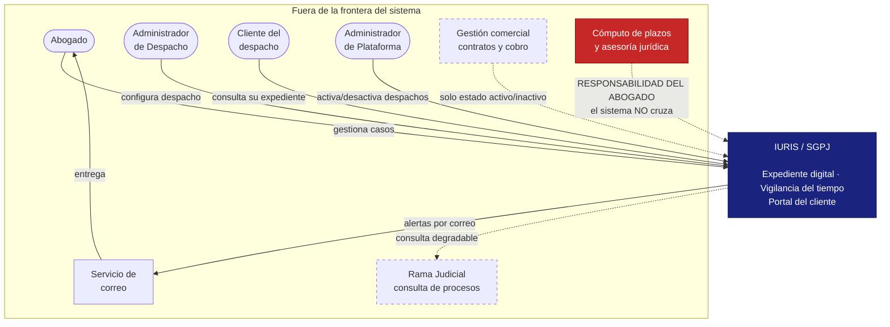
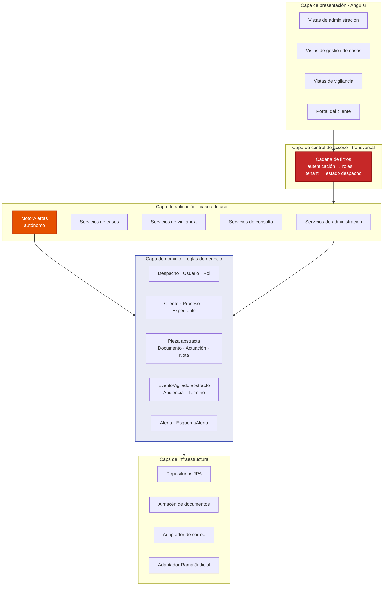
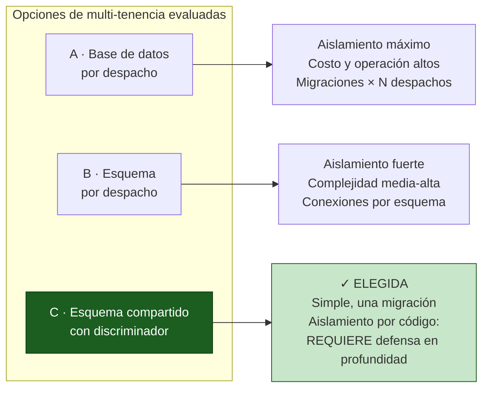
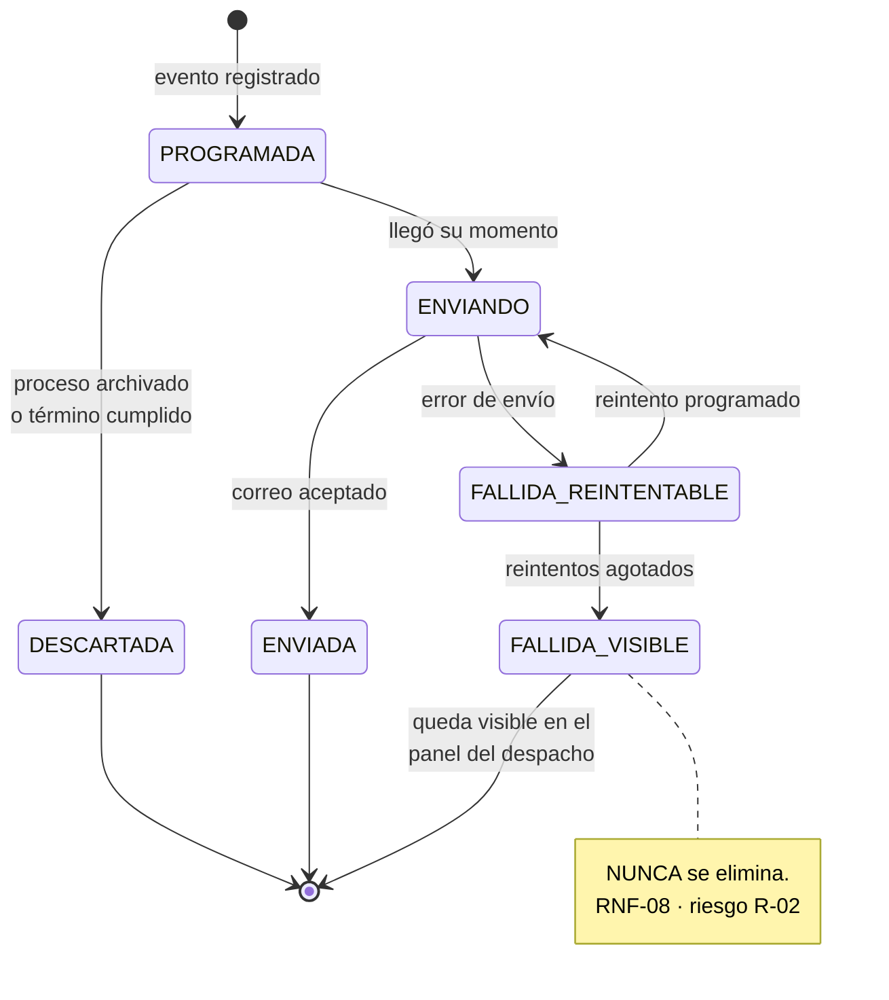
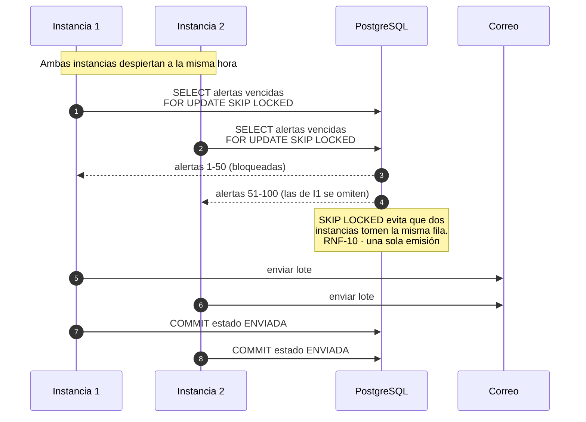
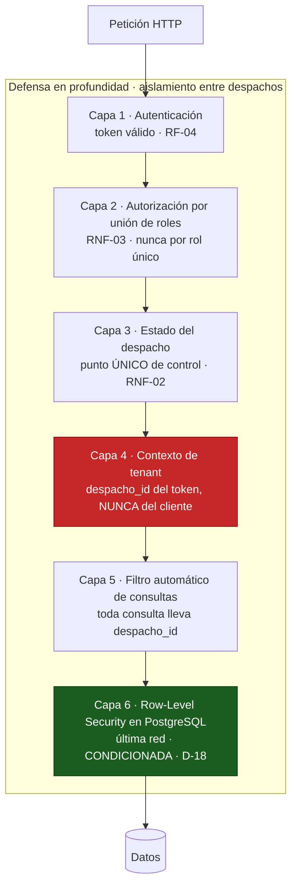

# Fase 6 — Descripción Arquitectónica
## Conforme a ISO/IEC/IEEE 42010

**Sistema:** Iuris / SGPJ — Sistema de Gestión de Procesos Jurídicos
**Deriva de:** [`05-diagramas.md`](05-diagramas.md) · [`04-historias-de-usuario.md`](04-historias-de-usuario.md) · [`03-requisitos-funcionales-y-no-funcionales.md`](03-requisitos-funcionales-y-no-funcionales.md) · [`02-reglas-de-negocio.md`](02-reglas-de-negocio.md) · [`01-idea-y-definicion-de-negocio.md`](01-idea-y-definicion-de-negocio.md)
**Versión:** 1.1 · **Fecha:** 2026-08-20 · **Estado: CERRADA** — decisiones D-17 a D-20 incorporadas

---

## 1. Identificación de la descripción arquitectónica

*(Requisito de identificación de la AD — ISO/IEC/IEEE 42010)*

| Campo | Valor |
|---|---|
| **Sistema de interés** | Iuris / SGPJ — plataforma web multi-despacho de gestión de procesos jurídicos |
| **Documento** | Descripción Arquitectónica (AD) |
| **Versión / fecha** | 1.1 · 2026-08-20 |
| **Autor** | Equipo de desarrollo — rol de Analista y Arquitecto de Software |
| **Norma de referencia** | ISO/IEC/IEEE 42010 — *Systems and software engineering — Architecture description* (edición vigente: 2022, revisión de la 42010:2011) |
| **Alcance** | Los 40 RF y 16 RNF de la Fase 3, sobre las 60 reglas de negocio de la Fase 2 |
| **Origen del sistema** | Propuesta 24, Competencia 220501094 (`24_propuesta.pdf`) |

### 1.1 Qué exige la norma y dónde se cumple aquí

La 42010 **no dicta una arquitectura**: dicta cómo debe *describirse* una. Exige que una AD contenga un conjunto determinado de elementos. Mapa de cumplimiento:

| Elemento exigido por la norma | Sección de este documento |
|---|---|
| Identificación de la AD | §1 |
| Identificación de **interesados** (*stakeholders*) | §2 |
| Identificación de **preocupaciones** (*concerns*) | §3 |
| **Puntos de vista** (*viewpoints*) — uno por cada preocupación atendida | §4 |
| **Vistas** (*views*) — una por punto de vista, con sus modelos | §5 |
| **Correspondencias** y reglas de correspondencia entre vistas | §6 |
| **Decisiones arquitectónicas** y su **justificación** (*rationale*) | §7 |
| Tratamiento de **inconsistencias conocidas** | §9 |

**Regla estructural de la norma que se respeta aquí:** *toda preocupación identificada debe ser atendida por al menos un punto de vista, y todo punto de vista debe existir porque atiende una preocupación de un interesado real.* No hay vistas decorativas. La verificación cruzada está en §4.1.

---

## 2. Interesados (*stakeholders*)

Se identifican a partir de los actores y del análisis de negocio de la Fase 1, más los interesados que no usan el sistema pero condicionan su diseño.

| ID | Interesado | Relación con el sistema |
|---|---|---|
| **ST-1** | **Abogado** | Usuario principal. Gestiona procesos y **es el destinatario de las alertas** — su trabajo depende de que el sistema no falle en avisar |
| **ST-2** | **Administrador de Despacho** | Configura el despacho, gestiona usuarios y catálogos, y accede a todos los expedientes |
| **ST-3** | **Cliente del despacho** | Consulta su propio expediente. **No es cliente del proyecto, pero sí interesado del sistema** |
| **ST-4** | **Administrador de Plataforma** | Opera Iuris: alta y estado de despachos. Nunca accede a expedientes |
| **ST-5** | **Equipo de desarrollo** | Construye y mantiene. Le preocupan modificabilidad y capacidad de prueba |
| **ST-6** | **Product Owner (instructor)** | Evalúa la conformidad con la propuesta y con los sprints |
| **ST-7** | **Autoridad disciplinaria** | **No usa el sistema, pero es la razón de su existencia.** El riesgo de sanción es lo que motiva la propuesta |
| **ST-8** | **Proveedor de infraestructura** | Nube, almacenamiento, correo. Condiciona disponibilidad y costos |

**Observación:** ST-7 es un interesado sin interfaz. Se incluye porque la 42010 pide identificar a quienes tienen *concerns* sobre el sistema, y el suyo —que el abogado no incurra en falta por un plazo vencido— es la preocupación que ordena toda la arquitectura.

---

## 3. Preocupaciones (*concerns*)

Cada preocupación se rastrea a su origen documental. **Ninguna es genérica**: todas salen de una regla, un riesgo o un requisito ya establecido.

| ID | Preocupación | Interesados | Origen |
|---|---|---|---|
| **C-1** | **Confidencialidad entre despachos.** Ningún despacho puede ver datos de otro; los expedientes están bajo reserva profesional | ST-1, ST-2, ST-3, ST-7 | RN-02 · RNF-01 · R-04 |
| **C-2** | **Confiabilidad de la alerta.** Ninguna alerta puede perderse en silencio; el abogado ya dejó de vigilar confiando en el sistema | ST-1, ST-7 | RN-34 · RNF-08 · **R-02** |
| **C-3** | **Puntualidad de la alerta.** Una alerta de 24h que llega tarde deja de ser una alerta de 24h | ST-1 | RNF-11 · RNF-10 |
| **C-4** | **Frontera de responsabilidad legal.** El sistema no calcula plazos ni presta asesoría; no puede asumir responsabilidad profesional | ST-1, ST-7 | RN-36, RN-48 |
| **C-5** | **Confidencialidad dentro del despacho.** Las notas del abogado nunca llegan al cliente | ST-1, ST-3 | RN-24 · R-06 |
| **C-6** | **Degradación ante servicios externos.** La caída de la Rama Judicial o del correo no puede detener el sistema | ST-1, ST-5 | RN-49 · R-01 |
| **C-7** | **Integridad y conservación del expediente.** Nada se borra; el expediente es el respaldo del despacho | ST-1, ST-2, ST-7 | RN-19, RN-27, RN-52 · RNF-14 |
| **C-8** | **Adopción y esfuerzo de registro.** Si registrar cuesta más que la agenda de papel, el sistema queda desactualizado y sus alertas dejan de ser fiables | ST-1 | RNF-16 · R-05 |
| **C-9** | **Modificabilidad y configurabilidad.** Cada despacho trabaja distinto: catálogos y esquemas de alerta propios | ST-2, ST-5 | D-13, D-16 · RF-33, RF-34 |
| **C-10** | **Capacidad de prueba de lo negativo.** Los fallos que destruyen el producto solo se detectan probando que algo **no** ocurre | ST-5 | HU-29, HU-34, HU-41 |
| **C-11** | **Rendimiento en el volumen objetivo.** Búsquedas por debajo de 3 segundos | ST-1, ST-8 | RNF-12 · S-03 |
| **C-12** | **Viabilidad en el cronograma.** Cuatro sprints de una semana, con carga concentrada en el 1 y el 3 | ST-5, ST-6 | R-09 · **[P]** |

**C-1 y C-2 son las preocupaciones dominantes.** Cuando cualquier decisión arquitectónica entre en conflicto con otra, se resuelve a favor de estas dos: su fallo no degrada el producto, lo destruye.

---

## 4. Puntos de vista arquitectónicos (*viewpoints*)

Cada punto de vista se define formalmente como pide la norma: qué preocupaciones atiende, para qué interesados, con qué tipos de modelo y qué notación.

### VP-1 · Contexto
| | |
|---|---|
| **Atiende** | C-4, C-6 |
| **Interesados** | ST-4, ST-5, ST-6 |
| **Tipos de modelo** | Diagrama de contexto de sistema |
| **Notación** | Mermaid flowchart |
| **Propósito** | Fijar la frontera del sistema: qué es responsabilidad de Iuris y qué no |

### VP-2 · Lógico-funcional
| | |
|---|---|
| **Atiende** | C-5, C-9, C-4 |
| **Interesados** | ST-5, ST-6 |
| **Tipos de modelo** | Capas, módulos, clases de dominio |
| **Notación** | Mermaid flowchart y classDiagram |
| **Propósito** | Estructura interna y ubicación de las reglas de negocio |

### VP-3 · Información
| | |
|---|---|
| **Atiende** | C-1, C-7, C-11 |
| **Interesados** | ST-2, ST-5, ST-7 |
| **Tipos de modelo** | Modelo entidad-relación, estrategia de multi-tenencia |
| **Notación** | Mermaid erDiagram |
| **Propósito** | Cómo se estructuran, aíslan y conservan los datos |

### VP-4 · Concurrencia y procesos autónomos
| | |
|---|---|
| **Atiende** | **C-2**, C-3 |
| **Interesados** | ST-1, ST-5, ST-7 |
| **Tipos de modelo** | Diagrama de estados de la alerta, secuencia del planificador |
| **Notación** | Mermaid stateDiagram y sequenceDiagram |
| **Propósito** | El comportamiento que **ningún usuario invoca**. Es el punto de vista que justifica el sistema |

### VP-5 · Despliegue
| | |
|---|---|
| **Atiende** | C-6, C-7, C-11 |
| **Interesados** | ST-4, ST-8, ST-5 |
| **Tipos de modelo** | Nodos, artefactos, canales |
| **Notación** | Mermaid flowchart |
| **Propósito** | Distribución física y puntos de fallo |

### VP-6 · Seguridad
| | |
|---|---|
| **Atiende** | **C-1**, C-5, C-10 |
| **Interesados** | ST-1, ST-2, ST-3, ST-7 |
| **Tipos de modelo** | Capas de defensa, cadena de control de acceso |
| **Notación** | Mermaid flowchart + tabla de controles |
| **Propósito** | Cómo se garantiza el aislamiento — la preocupación dominante |

### VP-7 · Confiabilidad y degradación
| | |
|---|---|
| **Atiende** | **C-2**, C-6, C-3 |
| **Interesados** | ST-1, ST-7 |
| **Tipos de modelo** | Escenarios de calidad, modos de fallo |
| **Notación** | Tablas de escenario estímulo-respuesta-medida |
| **Propósito** | Qué ocurre cuando algo falla |

### 4.1 Verificación exigida por la norma

**Toda preocupación debe estar atendida por al menos un punto de vista:**

| Preocupación | C-1 | C-2 | C-3 | C-4 | C-5 | C-6 | C-7 | C-8 | C-9 | C-10 | C-11 | C-12 |
|---|---|---|---|---|---|---|---|---|---|---|---|---|
| Atendida por | VP-3, VP-6 | VP-4, VP-7 | VP-4, VP-7 | VP-1, VP-2 | VP-2, VP-6 | VP-1, VP-5, VP-7 | VP-3, VP-5 | ⚠ *ver nota* | VP-2 | VP-6 | VP-3, VP-5 | ⚠ *ver nota* |

**Dos preocupaciones no tienen punto de vista arquitectónico, y es correcto que no lo tengan:**

- **C-8 (adopción)** se resuelve en diseño de interacción, no en arquitectura. Su tratamiento es RNF-16 y los criterios CA-20.2 y CA-22.3. Ninguna decisión estructural la mejora.
- **C-12 (cronograma)** es de gestión de proyecto, no de arquitectura. Se registra como R-09 y se atiende en el Sprint Planning.

Declararlas explícitamente como no atendidas por la arquitectura es parte del rigor de la norma: **una preocupación sin vista debe justificarse, no ignorarse.**

---

## 5. Vistas arquitectónicas (*views*)

### 5.1 Vista de Contexto — VP-1



**Las tres fronteras que fija esta vista:**

| Frontera | Qué queda fuera | Regla |
|---|---|---|
| **Legal** | El cómputo de plazos y la asesoría jurídica. El sistema recibe fechas, no las deduce | RN-36, RN-48 |
| **Comercial** | Contratos, precios, cobro. Solo entra el estado activo/inactivo | D-06 |
| **De control** | La Rama Judicial: se consulta, no se depende de ella | RN-49 |

### 5.2 Vista Lógico-funcional — VP-2



**La decisión estructural de esta vista: las reglas de negocio viven en la capa de dominio, no en los servicios ni en el frontend.**

Tres reglas críticas están implementadas como comportamiento del modelo, no como validación de formulario:

| Regla | Dónde vive | Por qué ahí |
|---|---|---|
| RN-24 · notas nunca al cliente | `Nota.esVisibleParaCliente()` → `false` | Polimórfica: una pieza nueva **obliga** a decidir su visibilidad |
| RN-37b · mínimo una alerta | `EsquemaAlerta.validar()` | Si viviera en el formulario, una carga masiva o una llamada a la API podría dejar cero alertas |
| RN-36 · no calcular plazos | Ausencia deliberada de método de cálculo en `Termino` | La frontera se protege por lo que **no existe** en el modelo |

### 5.3 Vista de Información — VP-3

El modelo entidad-relación completo está en la Fase 5 §3. Aquí se documenta la **decisión de multi-tenencia**, que es lo arquitectónico.



**Se elige la opción C** — esquema compartido con columna discriminadora `despacho_id`. Ver **ADR-02** en §7 para la justificación completa y las tres capas de defensa que compensan su punto débil.

### 5.4 Vista de Concurrencia y procesos autónomos — VP-4 ★

Es el punto de vista que atiende C-2, la preocupación que puede destruir el producto.

**Ciclo de vida de una alerta:**



**No existe transición hacia un estado de descarte silencioso.** Una alerta solo sale del ciclo por tres vías, y las tres dejan rastro: enviada, descartada por regla explícita, o fallida y visible.

**Emisión con múltiples instancias — resolución del pendiente de la Fase 5:**



Ver **ADR-04** para la justificación.

### 5.5 Vista de Despliegue — VP-5

El diagrama de nodos está en la Fase 5 §6. Aquí se documentan los **modos de fallo** por nodo, que es lo que aporta la vista arquitectónica:

| Nodo | Si falla | Impacto | Mitigación |
|---|---|---|---|
| Servidor web (Angular) | Nadie entra | Alto, pero **las alertas siguen emitiéndose** — viven en el backend | Recuperación estándar |
| Servidor de aplicaciones | Sistema caído y **vigilancia detenida** | **Crítico** | Es el nodo que concentra el riesgo. Ver ADR-01 §7 |
| PostgreSQL | Sistema caído | Crítico | Respaldo diario, restauración probada (RNF-14) |
| Almacén de documentos | No se cargan ni descargan documentos | Medio — el resto opera | Degradación parcial aceptable |
| Servicio de correo | **No salen alertas** | **Crítico para C-2** | Reintento + estado FALLIDA_VISIBLE + panel de vencimientos como respaldo visual |
| API Rama Judicial | No hay consulta externa | **Bajo, por diseño** | RN-49: registro manual, núcleo intacto |

**Observación importante:** la fila del servicio de correo es la que materializa por qué RF-23 (panel de vencimientos) no es redundante. Es la **segunda vía de defensa** cuando el canal primario cae.

### 5.6 Vista de Seguridad — VP-6 ★

Atiende C-1, la otra preocupación dominante.



**Capa 4 es la más importante y la más fácil de equivocar:** el `despacho_id` se toma **siempre del token de sesión, nunca de un parámetro enviado por el cliente**. Si el sistema aceptara un `despacho_id` desde la petición, el aislamiento sería una sugerencia: bastaría cambiar un número para leer expedientes ajenos.

**Capa 6 existe porque las capas 1-5 son código, y el código tiene errores.** Row-Level Security aplica la restricción en el motor de base de datos: aunque el código olvide el filtro, la base no devuelve filas ajenas.

**Pero la capa 6 es la única condicionada [D-18].** Tiene un costo real —la trampa del pool de conexiones, ver ADR-03— y por eso se le antepone un control que da la mayor parte del beneficio a menor costo: **la batería automatizada de pruebas de acceso cruzado por módulo (CA-41.3), obligatoria desde el Sprint 1**, que atrapa el olvido de filtro en integración continua en lugar de en producción. Ver **ADR-03**.

**Controles por preocupación:**

| Control | Preocupación | Requisito |
|---|---|---|
| Contraseñas con hash y salt | C-1 | RNF-05 |
| TLS en todo el tráfico | C-1 | RNF-06 |
| Cifrado de documentos en reposo | C-1 | RNF-04 |
| Filtrado de notas **en el servicio**, no en el frontend | C-5 | RF-30 · CA-34.2 |
| Bitácora inalterable desde la aplicación | C-1, C-7 | RNF-07 |
| Denegación explícita, no resultado vacío | C-1, C-10 | CA-41.2 |

### 5.7 Vista de Confiabilidad — VP-7

Escenarios de calidad en formato estímulo–respuesta–medida. Son la forma de convertir C-2, C-3 y C-6 en algo verificable.

| ID | Escenario | Estímulo | Respuesta requerida | Medida |
|---|---|---|---|---|
| **EQ-1** | Correo caído al emitir alerta | El servicio SMTP no responde | Reintentar; si se agotan, marcar FALLIDA y hacerla visible en el panel | La alerta **nunca** desaparece. Verificable con SMTP apagado |
| **EQ-2** | Reinicio durante la ventana de envío | La aplicación se reinicia mientras emite | Al reanudar, las alertas no enviadas siguen pendientes; las enviadas no se repiten | Exactamente **una** emisión por alerta (RNF-10) |
| **EQ-3** | Dos instancias simultáneas | Ambas despiertan a la misma hora | `SKIP LOCKED` reparte las filas | Cero alertas duplicadas |
| **EQ-4** | Rama Judicial caída | Timeout del servicio externo | Informar y ofrecer registro manual | **Cero impacto** en RF-01 a RF-34. Las alertas siguen saliendo |
| **EQ-5** | Retraso del planificador | Carga alta o pausa del proceso | Emitir en cuanto sea posible | Desviación máxima **15 minutos**, con planificador cada 5 min (RNF-11 · **D-19**) |
| **EQ-6** | Despacho desactivado con términos vigentes | Cambio de estado a inactivo | Bloquear el sistema **y** enviar aviso de corte | El abogado sabe desde cuándo vigila él (RF-37) |
| **EQ-7** | Acceso cruzado entre despachos | Usuario de A usa un identificador de B | Denegar explícitamente | 403, no resultado vacío. Prueba por módulo (CA-41.3) |

---

## 6. Correspondencias entre vistas

*(Elemento exigido por la norma: las vistas deben ser mutuamente consistentes, y las relaciones entre ellas, explícitas)*

### 6.1 Reglas de correspondencia

| ID | Regla | Vistas que relaciona |
|---|---|---|
| **RC-1** | Toda entidad de la vista de Información con `despacho_id` debe estar protegida por las capas 4, 5 y 6 de la vista de Seguridad | VP-3 ↔ VP-6 |
| **RC-2** | Toda clase de dominio de la vista Lógica debe tener su entidad correspondiente en la vista de Información | VP-2 ↔ VP-3 |
| **RC-3** | Todo estado de la alerta en la vista de Concurrencia debe existir como valor de `ALERTA.estado` en la vista de Información | VP-4 ↔ VP-3 |
| **RC-4** | Todo nodo de la vista de Despliegue que sea punto único de fallo debe tener un escenario de calidad en la vista de Confiabilidad | VP-5 ↔ VP-7 |
| **RC-5** | Todo sistema externo de la vista de Contexto debe aparecer con degradación definida en la vista de Confiabilidad | VP-1 ↔ VP-7 |

### 6.2 Verificación de correspondencias

| Regla | Verificación | Resultado |
|---|---|---|
| RC-1 | 8 entidades con `despacho_id`; todas pasan por la cadena de filtros y por RLS | ✅ |
| RC-2 | `Despacho`, `Usuario`, `Rol`, `Cliente`, `Proceso`, `Expediente`, `Pieza`+3, `EventoVigilado`+2, `Alerta`, `EsquemaAlerta` — todas presentes en el ER | ✅ |
| RC-3 | PROGRAMADA · ENVIANDO · ENVIADA · FALLIDA · DESCARTADA presentes en `ALERTA.estado` | ✅ |
| RC-4 | Servidor de aplicaciones → EQ-2, EQ-5 · PostgreSQL → RNF-14 · Correo → EQ-1 | ✅ |
| RC-5 | Rama Judicial → EQ-4 · Correo → EQ-1 | ✅ |

---

## 7. Decisiones arquitectónicas y justificación (*rationale*)

### ADR-01 · Monolito modular en capas, no microservicios

**Contexto:** 40 RF, 12 módulos, 4 sprints de una semana **[P]**, un equipo pequeño.

**Decisión:** una única aplicación Spring Boot organizada en capas y módulos internos con fronteras explícitas.

**Justificación:**
- Con **C-12** (cuatro semanas de desarrollo), microservicios añadirían despliegue distribuido, consistencia entre servicios y observabilidad — costo que el cronograma no soporta y que ningún requisito pide.
- **C-1 se cumple mejor en un monolito**: un único punto de control de acceso es más fácil de auditar que el mismo control replicado en N servicios. Multiplicar los servicios multiplica los lugares donde se puede olvidar el filtro de tenant.
- El volumen objetivo (**S-03**: 50 despachos) no justifica escalado independiente por servicio.

**Consecuencias:**
- ✅ Un despliegue, una migración, un punto de control.
- ⚠ El servidor de aplicaciones es punto único de fallo (vista VP-5). Aceptado: la mitigación es recuperación rápida, no distribución.
- ✅ Los módulos M1–M12 mantienen fronteras internas, de modo que una extracción futura sea posible sin rediseño.

**Alternativas descartadas:** microservicios (costo desproporcionado); monolito sin módulos (impide C-9 y dificulta la prueba de C-10).

---

### ADR-02 · Multi-tenencia por esquema compartido con discriminador

**Contexto:** **C-1** es preocupación dominante. Escala objetivo: decenas de despachos (S-03).

**Decisión:** una sola base de datos y un solo esquema; toda tabla raíz lleva `despacho_id`.

**Justificación:**
- Base por despacho daría el mayor aislamiento, pero multiplicaría por N las migraciones y la operación. Con 4 sprints y un equipo pequeño, **la complejidad operativa se convertiría ella misma en fuente de errores**.
- Esquema por despacho es intermedio, pero sigue exigiendo enrutamiento de conexiones y migraciones múltiples.
- Con el volumen de S-03, el discriminador es suficiente **siempre que se compense su punto débil**.

**Punto débil reconocido:** el aislamiento depende de que **cada consulta** incluya el filtro. Un olvido es una fuga (**R-04**).

**Compensación — y es la razón de que la decisión sea aceptable:** tres capas independientes, en ADR-03. Sin esas tres capas, esta decisión sería imprudente.

---

### ADR-03 · Aislamiento en cuatro controles: tres obligatorios y uno condicionado **[D-18]**

**Contexto:** compensar el punto débil de ADR-02 — el aislamiento depende de que cada consulta incluya el filtro de tenant.

**Decisión:** cuatro controles que fallan de forma independiente, con obligatoriedad explícitamente distinta:

| Control | Mecanismo | Protege contra | Obligatorio |
|---|---|---|---|
| 1 · Contexto de petición | El `despacho_id` se toma **del token**, nunca de un parámetro del cliente | Manipulación deliberada | **Sí** — Sprint 1 |
| 2 · Filtro automático de consultas | Filtro a nivel de ORM que añade la condición de tenant a toda consulta | Consulta escrita sin filtro | **Sí** — Sprint 1 |
| 3 · **Pruebas de acceso cruzado por módulo** | Batería automatizada (CA-41.3) como puerta de calidad en integración continua | **Olvido de filtro, detectado antes de producción** | **Sí** — Sprint 1 |
| 4 · Row-Level Security en PostgreSQL | El motor de base de datos aplica la restricción | Error humano en el código, incluido SQL nativo | **Condicionado** |

**Justificación:**
- Los controles 1 y 2 son código, y el código de un proyecto de cuatro semanas tendrá errores.
- **El control 3 es el que suele subestimarse.** Aporta la mayor parte del beneficio de RLS a una fracción de su costo: atrapa el olvido de filtro **en integración continua**, no en producción, y no depende de la infraestructura de conexiones.
- El control 4 es el único que sigue protegiendo cuando el código ya falló en producción.

**Costo real del control 4, que debe conocerse antes de comprometerlo:** RLS exige que cada transacción establezca el tenant en la sesión de base de datos. **Con un pool de conexiones esto es una trampa: si una conexión se devuelve al pool con el tenant de la petición anterior todavía establecido, la siguiente petición lo hereda — y se construye exactamente la fuga que se quería evitar.** Se implementa estableciendo el valor como local a la transacción, de modo que revierta al terminar; nunca como ajuste de sesión persistente.

**⚠ Segunda trampa del control 4, verificada en el entorno real (2026-08-20):** crear el rol como `NOSUPERUSER NOBYPASSRLS` **no basta**. En PostgreSQL el **dueño** de una tabla queda exento de las políticas RLS de esa misma tabla — y como Flyway crea las tablas conectado con el rol de la aplicación, ese rol acaba siendo dueño de todas. Se comprobó en `pg_tables`: `despacho` y `flyway_schema_history` pertenecen a `sgpj_app`. Cada tabla con datos de despacho necesitará además `ALTER TABLE ... FORCE ROW LEVEL SECURITY`. Sin ese `FORCE`, las políticas existirían y no se aplicarían a nadie.

**Condición explícita sobre el control 4:** si el equipo lo hace funcionar limpiamente con el pool, se mantiene. Si a mitad del Sprint 2 sigue sin resolverse, **se retira de forma consciente y documentada**, operando con los controles 1 a 3.

**Lo que no puede ocurrir es que se omita por olvido.** Esa es la diferencia entre un riesgo aceptado y un riesgo ignorado: sin el control 4, ADR-02 queda apoyada solo en código — precisamente la premisa que ella misma declaró insuficiente.

**Consecuencias:** tres barreras independientes desde el Sprint 1. El olvido de filtro se detecta en integración continua aunque RLS no llegue a implementarse. Si el control 4 se retira, **RA-2 vuelve a nivel medio** y debe registrarse como tal.

---

### ADR-04 · Alertas persistidas y planificador con bloqueo a nivel de fila

**Contexto:** **C-2** y **C-3**. Pendiente abierto en la Fase 5: dos instancias podrían emitir la misma alerta (RNF-10).

**Decisión:** cada alerta es una fila con estado. El planificador toma lotes con `SELECT … FOR UPDATE SKIP LOCKED`.

**Justificación:**
- **Persistir la alerta es lo que hace posible C-2.** Si se calcularan al vuelo, no habría forma de saber si se envió, de reintentar ni de demostrarlo (RNF-09).
- `SKIP LOCKED` resuelve la concurrencia **con la base de datos que ya existe**, sin añadir un componente nuevo de coordinación.
- Una alternativa válida sería una librería de bloqueo de tareas programadas; se prefiere `SKIP LOCKED` porque además **reparte** el trabajo en lugar de dejar una sola instancia trabajando.

**Consecuencias:** ✅ cierra el pendiente de la Fase 5 y satisface RNF-10 y EQ-3. ⚠ acopla la solución a un motor que soporte `SKIP LOCKED` — PostgreSQL lo hace.

#### Revisión durante la construcción — D-27 y D-28

Esta decisión se sostuvo, pero **su implementación cambió dos veces** al medir el sistema con el volumen objetivo. Se anota aquí porque la arquitectura que se sustenta debe ser la que corre, no la que se diseñó.

**El barrido dejó de ser una sola transacción (D-28 · H-6).** Lo era, y con ello se enviaban cien correos —irreversibles— antes de que el *commit* dejara constancia de que habían salido. Una reversión a media tanda devolvía las alertas a `PROGRAMADA` con los correos ya enviados, y el siguiente barrido los repetía: **CA-26.4 incumplido**. Ahora cada alerta se envía y se confirma en su propia transacción, y la relectura del estado **bajo bloqueo** —por alerta, ya no por lote— es lo que sigue impidiendo el envío doble entre instancias. `SKIP LOCKED` no se abandona: cambia de granularidad.

**El envío pasó a ser paralelo (D-27 · A-05).** La medición del volumen objetivo encontró **2.499 alertas venciendo en el mismo instante**, que con un lote de 100 cada 5 minutos tardaban **125 minutos** en drenarse frente a los 15 que tolera RNF-11. Un aviso cuesta **diez viajes de red que ningún lote ahorra** —son del protocolo SMTP y van por mensaje—, así que la única salida es no pagarlos en fila. Con cuatro conexiones simultáneas el pico baja a menos de un barrido.

**Lo que esto obliga a decidir fuera de la arquitectura:** cuatro conexiones despachando el lote son unos **6 envíos por segundo**. Un servicio transaccional lo admite; el SMTP de una cuenta personal no. **El proveedor de correo es ahora una restricción del despliegue**, no un detalle de configuración.

---

### ADR-05 · Documentos fuera de la base de datos, en almacén de objetos cifrado

**Contexto:** RNF-04 exige cifrado; RNF-13 admite archivos de hasta 20 MB.

**Decisión:** los documentos se guardan en un almacén de objetos con cifrado en reposo; en la base solo quedan metadatos y la referencia.

**Justificación:** guardar binarios de 20 MB en la base infla el respaldo, degrada el rendimiento (C-11) y complica la restauración. Separarlos permite políticas propias de cifrado y respaldo.

**Consecuencias:** ⚠ **el respaldo debe cubrir ambos almacenes.** Respaldar solo la base dejaría expedientes con metadatos sin documentos — un expediente inservible como respaldo (C-7). Queda como condición explícita de RNF-14.

---

### ADR-06 · Integración externa mediante adaptador con timeout y cortocircuito

**Contexto:** **C-6** y RN-49.

**Decisión:** la Rama Judicial se consume mediante un adaptador aislado con timeout agresivo y patrón de cortocircuito. Ningún servicio del núcleo depende de él.

**Justificación:** el servicio es externo y no controlado (**R-01**). Sin timeout, una consulta lenta bloquearía hilos de la aplicación y podría **arrastrar al motor de alertas** — es decir, un servicio externo terminaría causando el fallo C-2. El cortocircuito evita reintentar contra un servicio ya caído.

**Consecuencias:** ✅ EQ-4 se cumple por construcción. ✅ RF-36 es una propiedad de la estructura, no una promesa.

---

### ADR-07 · Las reglas críticas viven en el modelo de dominio

**Contexto:** **C-5**, C-4, C-10 y el riesgo R-08.

**Decisión:** RN-24, RN-36 y RN-37b se implementan en las clases de dominio, no en validaciones de formulario ni en la capa de presentación.

**Justificación:** una regla en el formulario protege **una** vía de entrada. El sistema tiene varias: interfaz, API, carga masiva, migración. Ubicar la regla en el dominio la hace válida para todas.

Caso concreto: si `EsquemaAlerta.validar()` viviera en Angular, una llamada directa a la API podría dejar un despacho con cero alertas — **R-08 materializado**.

**Consecuencias:** ✅ las reglas son verificables con pruebas unitarias sin levantar la aplicación, lo que atiende C-10. ✅ una pieza nueva del expediente obliga a implementar `esVisibleParaCliente()`.

---

### ADR-08 · Stack Java / Spring Boot + Angular

**Contexto:** la propuesta deja la celda TECNOLOGÍAS vacía **[P]**. Decisión tomada en **D-02**.

**Justificación desde las preocupaciones:** el stack ofrece de forma nativa los mecanismos que exigen las preocupaciones dominantes — cadena de filtros de seguridad para C-1, tareas programadas para C-2 y C-3, gestión declarativa de transacciones para C-7. La elección no fue por familiaridad, sino porque **cada preocupación crítica tiene un mecanismo estándar** en él.

**Consecuencias:** ⚠ el equipo debe conocer el ecosistema. ✅ ADR-03 (filtro de ORM), ADR-04 (planificador) y ADR-06 (cortocircuito) tienen soluciones establecidas, no artesanales.

---

### 7.1 Trazabilidad de las decisiones

| ADR | Preocupaciones que atiende | Riesgos que trata |
|---|---|---|
| ADR-01 monolito modular | C-1, C-9, C-12 | R-09 |
| ADR-02 multi-tenencia | C-1, C-11 | R-04 |
| ADR-03 aislamiento en 3 capas | **C-1**, C-10 | **R-04** |
| ADR-04 alertas persistidas + SKIP LOCKED | **C-2**, C-3 | **R-02** |
| ADR-05 documentos separados | C-1, C-7, C-11 | — |
| ADR-06 adaptador con cortocircuito | C-6, C-2 | R-01 |
| ADR-07 reglas en el dominio | C-4, C-5, C-10 | R-06, **R-08** |
| ADR-08 stack | todas | — |

**Las dos preocupaciones dominantes tienen cada una un ADR dedicado:** ADR-03 para C-1, ADR-04 para C-2.

---

## 8. Atributos de calidad y tácticas

| Atributo | Táctica arquitectónica | Dónde |
|---|---|---|
| **Confidencialidad** | Defensa en profundidad; tenant desde el token; RLS como última red | ADR-02, ADR-03 · VP-6 |
| **Confiabilidad** | Persistir el estado; reintento acotado; **hacer visible el fallo** en vez de ocultarlo | ADR-04 · VP-4, VP-7 |
| **Disponibilidad** | Degradación funcional: el núcleo opera sin servicios externos | ADR-06 · EQ-4 |
| **Integridad** | Sin borrado físico; bitácora inalterable; autoría en cada pieza | RN-19, RN-27 · RNF-07 |
| **Modificabilidad** | Catálogos y esquemas como **datos**, no como código | ADR-01 · RF-33, RF-34 |
| **Capacidad de prueba** | Reglas en el dominio, verificables sin levantar la aplicación | ADR-07 · C-10 |
| **Rendimiento** | Índices sobre los criterios de RNF02; binarios fuera de la base | ADR-05 · RNF-12 |

**La táctica de confiabilidad merece énfasis:** ante un fallo de alerta la arquitectura **hace ruido en vez de silencio**. Es contraintuitivo respecto al instinto de "manejar el error limpiamente", pero un error de envío manejado en silencio es exactamente el fallo R-02.

---

## 9. Riesgos arquitectónicos e inconsistencias conocidas

*(La norma exige declarar las inconsistencias conocidas en lugar de ocultarlas)*

| ID | Riesgo o inconsistencia | Estado |
|---|---|---|
| **RA-1** | El servidor de aplicaciones es punto único de fallo (ADR-01). Si cae, **la vigilancia se detiene** | **Aceptado.** Mitigación: recuperación rápida y panel de vencimientos como respaldo. Distribuir contradiría C-12 |
| **RA-2** | ADR-02 depende de que el filtro de tenant nunca se olvide | **Mitigado** por ADR-03 controles 1-3, obligatorios desde el Sprint 1. El control 4 (RLS) lo reduciría aún más; si se retira, el riesgo vuelve a **medio** y debe registrarse conscientemente |
| **RA-3** | `PROCESO.juzgado` como texto libre degradaba la búsqueda de P-RNF02 | **CERRADO** por **D-17**: quinto catálogo administrable por despacho, sin tablas nuevas |
| **RA-4** | Las cifras de RNF-11 a RNF-14 no estaban validadas | **CERRADO** por **D-19**: adoptadas como línea base revisable y convertidas en pruebas automatizadas. **RNF-11 corregido de 1 hora a 15 minutos** — con tolerancia horaria, la alerta de 24h podía salir a las 23h05 |
| **RA-5** | RLS (ADR-03 control 4) añade configuración que el equipo puede no dominar, incluida la trampa del pool de conexiones | **Aceptado y acotado** por **D-18**: es el único control condicionado; los controles 1-3 son obligatorios. Si se retira, debe hacerse de forma consciente y documentada, nunca por olvido |
| **RA-7** | La redistribución de sprints (**D-20**) estira el título del Sprint 2 al incluir el registro de audiencias | **Pendiente del visto bueno del Product Owner.** Alternativa si no se acepta: recortar dentro del Sprint 3 entregando RF-20 como lista en vez de calendario completo. Nada del motor de alertas se recorta |
| **RA-6** | La integración con Rama Judicial (ADR-06) no ha sido verificada técnicamente | **Aceptado.** RN-49 garantiza que su inviabilidad no afecta al núcleo |

---

## 10. Cierre

### Conformidad con la norma

| Elemento exigido | Estado |
|---|---|
| Identificación de la AD | ✅ §1 |
| Interesados identificados | ✅ 8 interesados, §2 |
| Preocupaciones identificadas | ✅ 12 preocupaciones trazadas a su origen, §3 |
| Puntos de vista definidos formalmente | ✅ 7 puntos de vista, §4 |
| Toda preocupación atendida o justificada | ✅ 10 atendidas, 2 justificadas como no arquitectónicas, §4.1 |
| Vistas con sus modelos | ✅ §5 |
| Correspondencias y su verificación | ✅ 5 reglas verificadas, §6 |
| Decisiones con justificación | ✅ 8 ADR con alternativas y consecuencias, §7 |
| Inconsistencias conocidas declaradas | ✅ 6 riesgos, 2 abiertos, §9 |

### Pendientes — resueltos

| # | Pendiente | Desenlace |
|---|---|---|
| **1** | A-04 — Juzgado como quinto catálogo | **D-17** — sí, administrable por despacho. Cierra RA-3 |
| **2** | Row-Level Security | **D-18** — controles 1-3 obligatorios desde el Sprint 1; RLS condicionado, con criterio de retirada explícito. ADR-03 reescrito |
| **3** | Las cifras de RNF-11 a RNF-14 | **D-19** — adoptadas como línea base y convertidas en pruebas. **RNF-11 corregido a 15 minutos** |
| **4** | R-09 — concentración de los Sprints 1 y 3 | **D-20** — cinco requisitos redistribuidos; el Sprint 3 queda dedicado al motor de alertas |

**Único punto que no depende del equipo:** **RA-7** — la aprobación del Product Owner sobre el movimiento de RF-19 al Sprint 2.

### La cadena completa

```
24_propuesta.pdf
      ↓
28 Decisiones registradas  ·  9 Riesgos de proyecto  ·  7 Riesgos arquitectónicos
      ↓
60 Reglas de Negocio
      ↓
56 Requisitos (40 RF + 16 RNF)
      ↓
44 Historias de Usuario con criterios de aceptación
      ↓
15 Diagramas en 10 categorías
      ↓
Descripción Arquitectónica ISO/IEC/IEEE 42010
   8 interesados · 12 preocupaciones · 7 puntos de vista · 8 decisiones
```

**Cualquier elemento de esta arquitectura puede rastrearse hasta la propuesta original o hasta una decisión registrada con su justificación.** Ese era el propósito del orden de trabajo, y se cumple.
